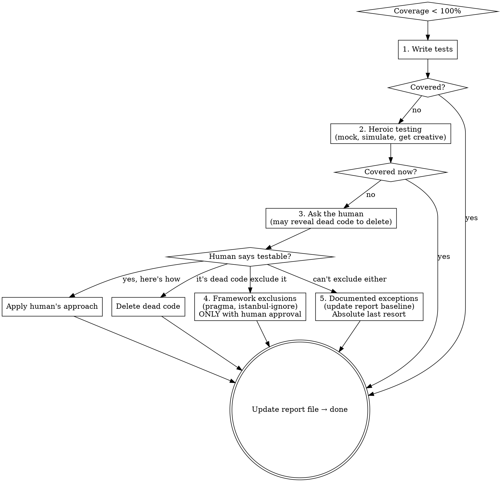

# Maintaining Full Coverage

## Overview

If the coverage report doesn't say 100% — or the linter has findings — you're not done. *(Unless the project never reached that bar and your current task isn't to get it there. Which of those you're in changes what "done" means — see Three Modes below.)*

**Core principle:** Every line of production code must be (a) exercised by a test and (b) clean against every linter/analyzer the project has configured. Uncovered lines are either untested (write a test) or unreachable (delete them). Lint findings are either real (fix them, ideally by restructuring) or genuine false positives (suppress per-case with explicit approval).

**Tests are not the only validators.** "Coverage" here means *covering the code with every check the project has* — tests for behavior, linters and analyzers for structure, type checkers for types. They're the same shape in the completion gate: machine-verifiable checked properties that must report clean before you declare done. Run them all, gate on all of them, restructure rather than suppress.

**Why this matters most:** Tests and linters earn their keep when they *accidentally surface real bugs*. A "unused variable" warning can reveal a typo that broke a code path. A `nullable` analyzer flagging a deref can pinpoint a real crash you missed. An uncovered branch can mean the condition is unreachable — i.e. dead code, often a bug. The discipline isn't paperwork; it's a structured way to make latent bugs visible. Treat findings as evidence first, noise second.

**This means ALL code, in ALL languages, in the ENTIRE repo.** A C# project with a C++ native library needs 100% coverage in both C# and C++, and Roslyn analyzers on the C# AND clang-tidy on the C++. A Python backend with a JavaScript frontend needs coverage.py + istanbul/c8 AND ruff + eslint. If production code exists in the repo and it's in a language you can compile/run, it needs coverage tooling, lint tooling, and tests. No language gets a pass.

**Violating the letter of this rule is violating the spirit of this rule.**

This skill is the final layer in a three-skill stack:

1. `test-driven-development` — writes tests before code
2. `verification-before-completion` — proves tests pass with evidence
3. `maintaining-full-coverage` — proves every line is covered AND every analyzer reports clean, and the report is updated

TDD is upstream discipline. Verification is evidence. This skill is the metric gate.

## Three Modes: what "the bar" means here

The 100%-coverage / 0-findings bar is the destination. Whether *this task* must arrive there depends on where the project starts and what you were asked to do. **Read the project's current state first** — the checked-in `TEST-REPORT.md` (if any) plus a fresh coverage + lint run — then place yourself in one of three modes:

**1. Maintain — the project is already clean.** Coverage is 100% and every configured linter reports 0 findings (the report says so and a fresh run confirms it). The bar is absolute: hold it. Your change must not drop coverage below 100% and must not add a single finding. This is the strict gate — a regression here is blocked, full stop. Everything below about the completion gate and escalation ladder applies at full strength.

**2. Close the gap — reaching the bar IS the task.** The project isn't at 100% / 0 findings, and the user asked you to get it there ("add coverage", "clean up the lint", "get this to green", "set up the gate"). Then 100% / 0 is the deliverable and the full escalation ladder applies to every uncovered line and every finding — same strict bar as Maintain, because reaching it is the point.

**3. Best effort — the project is dirty and you're doing something else.** The project is below 100% / has findings, and your task is a feature, bugfix, or refactor — not a coverage/lint cleanup. Demanding the *whole repo* reach 100% before you can finish an unrelated feature is the hardline mistake this mode exists to prevent. The bar here is a **ratchet, not an absolute**:

- **Cover and clean what you touch.** New and changed production code gets tests and is lint-clean. You don't get to add debt just because debt already exists.
- **Don't regress the baseline.** Coverage percentage must not fall and the finding count must not rise versus the checked-in report. Those numbers are the floor.
- **Surface pre-existing debt; don't silently inherit it.** The 1,244 findings you didn't create aren't a blocker for *this* task — but record them in the report as the baseline and flag them (suggest a cleanup task). Don't pretend they're absent, and don't let them quietly grow.
- The escalation ladder still governs *your own* uncovered lines and findings. Best effort is not a license to skip testing the code you just wrote.

**When the mode is ambiguous, ask.** If the project is dirty and you can't tell whether the user wants gap-closing (mode 2) or best-effort-on-a-feature (mode 3), ask which — one short question. Don't silently default to the hardline (you'll block an unrelated task on inherited debt) and don't silently default to lax (you'll let a project that wanted cleanup stay dirty).

The report file records which mode applied and the baseline it measured against, so the next session knows whether a number is a ceiling to hold or a floor to ratchet up from.

## When to Use

**Before you declare anything "done":**

- You wrote or changed production code → this skill applies
- You're about to say "all passing", "here's what changed", or summarize your work → STOP, run coverage first
- You're about to commit or push → STOP, run coverage first
- User asks you to commit → this is a completion event, run coverage before the commit

**Always:**

- Completing a feature, bugfix, or refactor
- Setting up coverage tracking for a new project
- Reviewing whether work is ready to commit

**The test you wrote passing is not the finish line. 100% suite-wide coverage is the finish line** — in a project at or chasing that bar. In a below-bar project where coverage cleanup isn't the task, the finish line is: your new code covered, the baseline not regressed (see Three Modes).

**Throughout development (the nudge):**
While coding, periodically ask yourself: "If I ran coverage right now, would the code I just wrote be covered?" Every `if` has at least two paths. Every `try` has an `except`. Every early `return` has a condition that triggers it. Are both branches tested?

Don't batch all test-writing to the end. Write tests alongside code. Coverage debt compounds.

## The Completion Gate

```text
BEFORE claiming completion:

1. FIND the repo's coverage command. Check in this order:
   a. AGENTS.md or CLAUDE.md — look for a documented coverage command
   b. Scripts directory — look for run-coverage, coverage, or test scripts
      (e.g., scripts/run-coverage.ps1, scripts/coverage.sh)
   c. CI config — .github/workflows, Makefile, etc.
   d. If none found, construct one that covers ALL test projects in the repo
      (not just one — search for all *.csproj with test references,
       all test directories, etc.)
   IMPORTANT: Coverage must include the ENTIRE repo, not a single project.
2. VERIFY the command covers all production code IN EVERY LANGUAGE.
   Do NOT trust AGENTS.md/CLAUDE.md or existing scripts blindly — they may be incomplete.
   a. Scan the repo for ALL production code across ALL languages
      (e.g., *.cs, *.cpp, *.h, *.js, *.ts, *.py, *.go, *.rs, etc.)
   b. For EACH language with production code, identify the coverage tool
      (e.g., dotnet-coverage for C#, gcov/llvm-cov for C++, istanbul/c8
      for JS/TS, coverage.py for Python, go cover for Go)
   c. Check which assemblies/packages/modules the coverage commands
      actually instrument
   d. If any production code in any language is excluded, fix it before running
   Example: a repo has C# managed code and a C++ native library — you need
   BOTH dotnet-coverage AND gcov/llvm-cov. One coverage tool is not enough.
   Example: a repo has a Python API and a React frontend — you need BOTH
   coverage.py AND istanbul/c8. The frontend JS is not optional.
3. RUN it — fresh, full, no cache
4. READ the output — actual percentage, uncovered lines
5. Is it 100%?
   - YES → continue to step 6
   - NO  → enter the Escalation Ladder below
           Do NOT claim completion. Do NOT skip to exclusions.
6. WRITE or UPDATE `TEST-REPORT.md` at the repo root
   - Use the format from the Report File Convention section
   - Include the current git hash, test count, and coverage numbers
   - This file is a REQUIRED artifact — do not skip this step
7. COMMIT `TEST-REPORT.md` alongside your other changes
8. ONLY after the report file is written and committed: done
```

The report file is a first-class artifact. It is not an afterthought. Write it and commit it as part of your work, not as a cleanup step later.

Step 5 above ("Is it 100%? NO → don't claim completion") is written for Maintain and Close-the-Gap mode. In Best-Effort mode the test is different: *did I cover the code I touched, and did I hold the baseline?* If yes, you're done for this task even though the absolute number is below 100% — record the baseline in the report (mode `best-effort`) and surface the remaining gap. See Three Modes.

## The Lint Gate

The completion gate above checks coverage. There is a second gate, run in the same place in the workflow (before declaring done, before committing, before saying "all passing/clean"), against the project's linters and static analyzers.

```text
BEFORE claiming completion:

1. FIND the project's linters / static analyzers. Check in this order:
   a. AGENTS.md or CLAUDE.md — look for a documented lint command
   b. Project config — pyproject.toml [tool.ruff]/[tool.mypy], package.json
      (`lint` / `eslint` scripts), .clang-tidy, *.sln + .editorconfig
      (Roslyn analyzers), .resharper.dotsettings (JetBrains inspections),
      golangci.yml, .rubocop.yml, etc.
   c. Pre-commit / CI config — .pre-commit-config.yaml, .github/workflows,
      .gitea/workflows
   d. If the language has a standard linter (ruff for Python, eslint for
      JS/TS, golangci-lint for Go, clang-tidy for C/C++, etc.) and none is
      configured, ASK the human whether to add one — don't silently assume
      "this project doesn't lint."
2. VERIFY the linter covers all production code IN EVERY LANGUAGE (same
   all-languages logic as the coverage gate). A multi-language repo needs
   each language's checker, not just the dominant language's.
3. RUN it — full repo, all configured rules, no cache. Slow linters
   (jbinspect/inspectcode, full-repo clang-tidy) can take minutes; run
   them anyway. "It's slow" is not in the Escalation Ladder.
4. READ the output — findings count, severity, locations. Don't just
   check exit code; count findings.
5. Is the count 0?
   - YES → continue to step 6
   - NO  → enter the Escalation Ladder below. Same shape as coverage:
           fix the code → restructure (see Restructure Over Exclude) →
           ask the human → per-case suppression with approval →
           documented exception in the report file.
           Do NOT suppress to declare done.
6. UPDATE `TEST-REPORT.md` with the Lint section (see Report File Convention).
7. COMMIT the updated report alongside your other changes.
8. ONLY after the report is written and committed: done.
```

**The bar is 0 findings, matching the 100% coverage bar — read through the active mode (see Three Modes).** In Maintain or Close-the-Gap mode, pre-existing findings count: 1000 ruff warnings is debt that enters the Escalation Ladder the same way uncovered branches do. In Best-Effort mode, you don't have to clear inherited findings to finish an unrelated task — but you don't add new ones, you don't let the count climb, and you record the baseline and surface the debt rather than silently inheriting it. Most findings can be fixed outright. Some surface real bugs (treat them as evidence — investigate before suppressing). The genuinely-intractable ones get per-case documented exceptions.

**Handling the reactive side of the ladder:** see `Restructure Over Exclude` below — when a finding tempts you to reach for `[SuppressMessage]` / `// ReSharper disable` / `NOLINT` / `# noqa` / `eslint-disable`, restructure first.

## The Escalation Ladder

When either gate fails (coverage <100% or any lint finding), follow this order. **Never skip steps.**



**Step 1 — Write tests.** Most uncovered lines are straightforwardly testable. Just write the test.

**Step 2 — Heroic testing.** Mock OS calls, simulate errors, use framework features creatively. See Heroic Coverage Scenarios below. 100% is almost always achievable.

**Step 3 — Ask the human.** If you genuinely cannot figure out how to cover a line, ask. Do not guess. Do not skip this step. Two likely outcomes:

- The code is unreachable/dead → **delete it.** Dead code is a bug, not an exception.
- The human knows a testing trick you don't → apply it.

**Step 4 — Framework exclusions.** `# pragma: no cover`, `/* istanbul ignore */`, etc. **Only with explicit human approval.** These produce a synthetic 100% in the report. Never apply these silently.

**Step 5 — Documented exceptions.** Absolute last resort. The report file explicitly lists what's uncovered and why. This becomes the new baseline that other work must meet.

## Restructure Over Exclude

Before reaching for an exclusion (escalation step 4) or a static-analysis suppression, ask whether restructuring the production code eliminates the problem outright. When code tangles things that shouldn't be tangled — startup side effects, untestable singletons, network calls inline with business logic — refactor rather than excluding tests or weakening assertions. This is the same lever as deleting dead code: it improves the codebase, and restructuring to be testable is not overkill.

### Uncovered branches

A coverage tool counts a synthetic branch the cooperative-cancellation idiom never reaches. Restructure to remove the branch rather than excluding the line:

```kotlin
// Before: Kover counts the while-false branch as uncovered
while (isActive) { delay(1000); evictExpired() }

// After: no unreachable branch (delay() throws CancellationException on cancellation)
while (true) { delay(1000); evictExpired() }
```

The `while (isActive)` form has a false branch the tool can't reach (cancellation is by exception, never by loop exit); `while (true)` eliminates it without changing behavior. The same shape recurs across languages — Python's `asyncio.CancelledError` (`while running:` → `while True:`) and .NET's `CancellationToken.ThrowIfCancellationRequested()` inside `while (true)` (replacing `while (!token.IsCancellationRequested)`).

### Analyzer suppressions

The same bias extends to static-analysis suppressions — `[SuppressMessage]`, `// ReSharper disable`, `NOLINT`. A warning you're tempted to silence often points at a real structural problem; restructuring to satisfy it can surface a genuine bug instead of hiding one. Never mass-suppress a category as "technically false positives" — demand a per-case justification for the rare real one.

In git-wizard (C#), a JetBrains `AccessToDisposedClosure` inspection flagged 18 sites. Bulk suppression was tempting; the structural fix was better. On the dominant pattern, moving the `using` inside the lambda makes test lifetime explicit in code instead of asserted in a comment:

```csharp
// Before — analyzer flags the disposable captured by the lambda
using var volume = new Volume(...);
Assert.ThrowsException<X>(() => volume.DoSomething());

// After — `using` inside the lambda; lifetime is explicit, warning gone
Assert.ThrowsException<X>(() => { using var volume = new Volume(...); volume.DoSomething(); });
```

For a callback stored on a longer-lived object, capture the **value** you need, not the disposable:

```csharp
var uiThreadId = dispatcher.UiThreadId;     // capture the value up front, not the disposable
obj.Callback = () => ranOnUi = Environment.CurrentManagedThreadId == uiThreadId;
```

Both eliminate the warning because the analyzer's premise no longer holds — and read better than the original. Suppression hides the smell; restructuring removes it.

### The legitimate exclusion case

Exclusion is correct for genuinely-untestable framework bindings — Android `MediaCodec`, `NSDManager`, XR Compose composables that require a running platform. Exclude those *specifically*, never whole-class blanket exclusions on production logic. If an exclusion attribute lands on a class whose name doesn't end in `Binding`, `Adapter`, or a similar platform-glue suffix, that's a smell that wants restructuring first.

## Report File Convention

Every project maintains a checked-in coverage report at the **repo root** named `TEST-REPORT.md`. If a project already has a report file under a different name, use that. Otherwise, create `TEST-REPORT.md`.

### Creating or updating the report

After running coverage, **you must** write or overwrite `TEST-REPORT.md` with the results. This is not optional — it is a required artifact of every coverage run.

1. Get the current git short hash: `git rev-parse --short HEAD`
2. Get the total test count from the test runner output
3. Get line/branch/method coverage from the coverage tool output
4. Write `TEST-REPORT.md` at the repo root using the format below
5. Stage and commit it alongside your other changes

### Minimal required format

```text
<project> test report — <ISO 8601 timestamp>
═══════════════════════════════════════════

Status:   PASS | FAIL
Mode:     maintain | close-the-gap | best-effort
Tests:    <total> total
Git:      <short hash> (<branch or commit message>)
Coverage: <covered>/<total> statements (<pct>%)
          <N> lines uncovered
          <N> exclusion annotations
Lint:     <tool>: <N> findings (<N> errors, <N> warnings)
          [one line per configured tool]
          <N> per-case suppressions
          <N> documented exceptions
```

The **Lint** block is required when the project has any linter or analyzer configured. List every configured tool — `ruff`, `mypy`, `eslint`, `clang-tidy`, `inspectcode`/`jbinspect`, `golangci-lint`, Roslyn analyzers, etc.

The **Mode** line records which of the Three Modes governed this run, so a future reader knows whether a number is a ceiling to hold or a floor to ratchet up from. `Status` is defined relative to that mode:

- **maintain / close-the-gap:** `PASS` only when coverage is 100% AND every tool reports 0 findings (per-case suppressions and documented exceptions count as cleared, same as `pragma: no cover` does for coverage).
- **best-effort:** `PASS` when your changed code is covered and lint-clean AND the baseline did not regress (coverage % didn't drop, finding count didn't rise). Record the inherited baseline (e.g. `Coverage: 312/400 (78%) — baseline held`, `Lint: eslint 1244 findings (pre-existing baseline, +0 this change)`) so the ratchet is auditable. A best-effort `PASS` is honest about not being at the absolute bar; it is not a `FAIL`.

Beyond the minimum, projects add whatever is useful — per-suite breakdowns, branch coverage, UI audit stats, timing.

### Report file rules

- **Lives at repo root as `TEST-REPORT.md`** unless the project already has a report file elsewhere.
- **Checked into the repo.** Tracked in git history. `git diff` on the report instantly shows regressions.
- **Updated whenever tests or coverage change.** Not "later" — now, as part of the work.
- **Git hash above coverage results.** It establishes what code the numbers describe.
- **AGENTS.md (or CLAUDE.md) documents the coverage command** and references `TEST-REPORT.md`.
- **With CI:** PRs that regress coverage are rejected unless an exemption grants a new baseline.
- **Without CI:** Honor system, but git history still catches regressions.

## Heroic Coverage Scenarios

100% is almost always achievable. These patterns prove it.

### OS/platform-specific code

Mock `platform.system()`, `Path.read_text()` with `PurePosixPath` comparison, `os.execv()`. Test both branches even on one OS.

### Error paths requiring external failures

Mock the dependency — database errors, network timeouts, permission denied. The error handler exists because it can happen. Simulate it.

### Elevated/admin-only code paths

Mock the privilege check to test both paths. For things that genuinely cannot be mocked (e.g., UAC prompts), interactive tests are an option: show an instructional dialog ahead of the system prompt ("you should say yes to this one" / "you should say no to the next one") so the human knows what to do during the test run.

### Browser/integration coverage

Puppeteer/Playwright tests hitting every route and handler. UI audit scripts tracking which pages, functions, and handlers are exercised.

### Startup/shutdown code

Test initialization with mocked dependencies. Trigger cleanup/teardown paths explicitly.

### The bottom line

If you think a line is untestable, you are probably wrong. Mock harder, simulate the condition, or ask the human — they may know a trick, or the code might be dead and should be deleted.

## Rationalization Table

| Excuse | Reality |
|--------|---------|
| "That line is unreachable" | Then delete it. Dead code is a bug, not an exception. |
| "It's just error handling" | Error handlers exist because errors happen. Mock the error. |
| "I can't test platform-specific code" | Mock the platform check. Test both branches. |
| "Coverage is 98%, close enough" | 98% means uncovered lines. Find them. Test them. |
| "I'll add tests later" | Later never comes. The gate is now. |
| "This is just config/glue code" | Config can break. Glue can fail. Test it. |
| "The framework makes this untestable" | Ask the human. They may know a trick, or the code should be restructured. |
| "Adding `pragma: no cover` is faster" | Exclusions require human approval. Try testing first. |
| "Asking the human takes longer than just fixing it" | If you can fix it, fix it. If you can't, ask. Don't reach for pragma instead of asking. |
| "I'll update the report file after" | The report is a first-class artifact. Update it now, commit it with your changes. |
| "Both branches do the same thing, testing one is enough" | The coverage tool disagrees. Test both. |
| "The C++/JS/other-language code is a separate concern" | If it's in the repo and it's production code, it needs 100% coverage. Set up the coverage tool for that language. |
| "I got 100% on the C# / Python / main language" | That's 100% of ONE language. Check ALL languages in the repo. Every language needs its own coverage tooling. |
| "It's just a lint warning, not a real bug" | Sometimes true; often the linter found something you missed. Investigate before suppressing. The bug-surfacing case is exactly why the gate exists. |
| "The linter is wrong / it's a false positive" | False positives are real but rare. Restructure the code so the analyzer's premise no longer holds (see Restructure Over Exclude). Per-case suppression requires human approval. |
| "Lint debt is pre-existing, not my problem" | Depends on mode. Maintain / close-the-gap: it's your problem — enter the Escalation Ladder. Best-effort on an unrelated task: you needn't clear inherited debt, but you don't add to it, don't let the count grow, and you record + surface the baseline rather than silently ignoring it. |
| "Running jbinspect / clang-tidy / mypy is too slow" | Run it anyway. "Slow" is not a step in the Escalation Ladder. If you must defer, raise it with the human — don't skip silently. |
| "The project doesn't lint" | Did you check? `pyproject.toml`, `package.json`, `.clang-tidy`, `*.sln`, `.pre-commit-config.yaml`, CI workflows — verify before assuming. |

## Red Flags — STOP and Reconsider

- Reaching for `pragma: no cover` before attempting to test the line
- Reaching for `pragma: no cover` before asking the human
- Claiming completion with uncovered lines you haven't investigated
- Assuming code is unreachable without verifying (it might be dead — delete it)
- Batching all test-writing to the end
- Treating `TEST-REPORT.md` as optional or "I'll do it later"
- Claiming completion without writing or updating `TEST-REPORT.md`
- Skipping straight to step 4 or 5 of the escalation ladder
- Writing tests that cover the line but don't test meaningful behavior
- Forgetting to test both branches of a conditional
- Declaring 100% coverage when you only checked one language in a multi-language repo
- Ignoring C++, JavaScript, or other secondary languages because the "main" language has full coverage
- Reaching for `# noqa` / `eslint-disable` / `[SuppressMessage]` / `// ReSharper disable` / `NOLINT` before attempting to restructure (see Restructure Over Exclude)
- Declaring "lint clean" without actually running the linter
- Skipping the lint gate because "the project doesn't lint" without verifying via project config / CI
