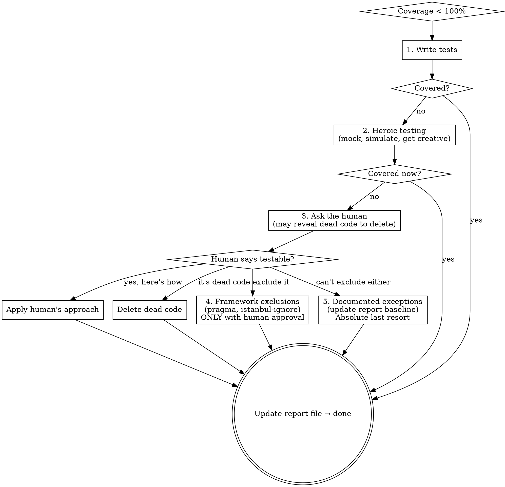

# Maintaining Full Coverage

## Overview

If the coverage report doesn't say 100%, you're not done.

**Core principle:** Every line of production code must be exercised by a test. Uncovered lines are either untested (write a test) or unreachable (delete them).

**Violating the letter of this rule is violating the spirit of this rule.**

This skill is the final layer in a three-skill stack:
1. `test-driven-development` — writes tests before code
2. `verification-before-completion` — proves tests pass with evidence
3. `maintaining-full-coverage` — proves every line is covered and the report is updated

TDD is upstream discipline. Verification is evidence. This skill is the metric gate.

## When to Use

**Always:**
- Completing a feature, bugfix, or refactor
- Setting up coverage tracking for a new project
- Reviewing whether work is ready to commit

**Throughout development (the nudge):**
While coding, periodically ask yourself: "If I ran coverage right now, would the code I just wrote be covered?" Every `if` has at least two paths. Every `try` has an `except`. Every early `return` has a condition that triggers it. Are both branches tested?

Don't batch all test-writing to the end. Write tests alongside code. Coverage debt compounds.

## The Completion Gate

```
BEFORE claiming completion:

1. FIND the project's coverage command (CLAUDE.md, scripts, etc.)
2. RUN it — fresh, full, no cache
3. READ the output — actual percentage, uncovered lines
4. Is it 100%?
   - YES → update the report file, commit it alongside your changes
   - NO  → enter the Escalation Ladder below
           Do NOT claim completion. Do NOT skip to exclusions.
5. ONLY after the report says 100%: done
```

The report file is a first-class artifact. It is not an afterthought. Update it and commit it as part of your work, not as a cleanup step later.

## The Escalation Ladder

When coverage is below 100%, follow this order. **Never skip steps.**



**Step 1 — Write tests.** Most uncovered lines are straightforwardly testable. Just write the test.

**Step 2 — Heroic testing.** Mock OS calls, simulate errors, use framework features creatively. See Heroic Coverage Scenarios below. 100% is almost always achievable.

**Step 3 — Ask the human.** If you genuinely cannot figure out how to cover a line, ask. Do not guess. Do not skip this step. Two likely outcomes:
- The code is unreachable/dead → **delete it.** Dead code is a bug, not an exception.
- The human knows a testing trick you don't → apply it.

**Step 4 — Framework exclusions.** `# pragma: no cover`, `/* istanbul ignore */`, etc. **Only with explicit human approval.** These produce a synthetic 100% in the report. Never apply these silently.

**Step 5 — Documented exceptions.** Absolute last resort. The report file explicitly lists what's uncovered and why. This becomes the new baseline that other work must meet.

## Report File Convention

Every project maintains a checked-in coverage report. Minimal required format:

```
<project> test report — <ISO 8601 timestamp>
═══════════════════════════════════════════

Status:   PASS | FAIL
Tests:    <total> total
Git:      <short hash> (<branch or commit message>)
Coverage: <covered>/<total> statements (<pct>%)
          <N> lines uncovered
          <N> exclusion annotations
```

Beyond the minimum, projects add whatever is useful — per-suite breakdowns, branch coverage, UI audit stats, timing.

### Report file rules

- **Checked into the repo.** Tracked in git history. `git diff` on the report instantly shows regressions.
- **Updated whenever tests or coverage change.** Not "later" — now, as part of the work.
- **Git hash above coverage results.** It establishes what code the numbers describe.
- **CLAUDE.md documents the command** that generates the report and where it lives.
- **With CI:** PRs that regress coverage are rejected unless an exemption grants a new baseline.
- **Without CI:** Honor system, but git history still catches regressions.

## Heroic Coverage Scenarios

100% is almost always achievable. These patterns prove it.

### OS/platform-specific code
Mock `platform.system()`, `Path.read_text()` with `PurePosixPath` comparison, `os.execv()`. Test both branches even on one OS.

### Error paths requiring external failures
Mock the dependency — database errors, network timeouts, permission denied. The error handler exists because it can happen. Simulate it.

### Elevated/admin-only code paths
Mock the privilege check to test both paths. For things that genuinely cannot be mocked (e.g., UAC prompts), interactive tests are an option: show an instructional dialog ahead of the system prompt ("you should say yes to this one" / "you should say no to the next one") so the human knows what to do during the test run.

### Browser/integration coverage
Puppeteer/Playwright tests hitting every route and handler. UI audit scripts tracking which pages, functions, and handlers are exercised.

### Startup/shutdown code
Test initialization with mocked dependencies. Trigger cleanup/teardown paths explicitly.

### The bottom line
If you think a line is untestable, you are probably wrong. Mock harder, simulate the condition, or ask the human — they may know a trick, or the code might be dead and should be deleted.

## Rationalization Table

| Excuse | Reality |
|--------|---------|
| "That line is unreachable" | Then delete it. Dead code is a bug, not an exception. |
| "It's just error handling" | Error handlers exist because errors happen. Mock the error. |
| "I can't test platform-specific code" | Mock the platform check. Test both branches. |
| "Coverage is 98%, close enough" | 98% means uncovered lines. Find them. Test them. |
| "I'll add tests later" | Later never comes. The gate is now. |
| "This is just config/glue code" | Config can break. Glue can fail. Test it. |
| "The framework makes this untestable" | Ask the human. They may know a trick, or the code should be restructured. |
| "Adding `pragma: no cover` is faster" | Exclusions require human approval. Try testing first. |
| "Asking the human takes longer than just fixing it" | If you can fix it, fix it. If you can't, ask. Don't reach for pragma instead of asking. |
| "I'll update the report file after" | The report is a first-class artifact. Update it now, commit it with your changes. |
| "Both branches do the same thing, testing one is enough" | The coverage tool disagrees. Test both. |

## Red Flags — STOP and Reconsider

- Reaching for `pragma: no cover` before attempting to test the line
- Reaching for `pragma: no cover` before asking the human
- Claiming completion with uncovered lines you haven't investigated
- Assuming code is unreachable without verifying (it might be dead — delete it)
- Batching all test-writing to the end
- Treating the report file as optional or "I'll do it later"
- Skipping straight to step 4 or 5 of the escalation ladder
- Writing tests that cover the line but don't test meaningful behavior
- Forgetting to test both branches of a conditional
